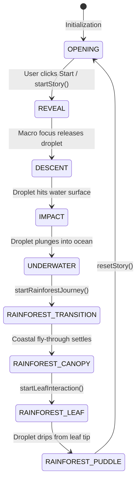

# PĀNI Architecture Reference

This document provides a technical overview of the **PĀNI** real-time 3D procedural simulation and rendering architecture.

---

## 1. System Overview

PĀNI is engineered as a decoupled real-time WebGL application with:
* An engine core managing WebGL rendering, clock, and quality tiers.
* A procedural world system generating ocean waves, atmospheric scattering, underwater volumes, and rainforest environments.
* Physical fluid simulation tracking hero droplet dynamics and surface interactions.
* A story director state machine governing narrative progression and camera choreography.
* A Puppeteer-based automated verification suite.

```
                           +-------------------+
                           |    main.tsx /     |
                           |     App.tsx       |
                           +---------+---------+
                                     |
                           +---------v---------+
                           |    Experience     |
                           +----+----+----+----+
                                |    |    |
        +-----------------------+    |    +-----------------------+
        |                            |                            |
+-------v-------+            +-------v-------+            +-------v-------+
|  Engine Core  |            |  World & Env  |            | Story & Motion|
| - Renderer    |            | - Ocean       |            | - StoryDirector
| - Clock       |            | - Sky / Sun   |            | - DropCamera  |
| - QualityMgr  |            | - Underwater  |            | - GSAP Timelines
+---------------+            | - Rainforest  |            +---------------+
                             +-------+-------+
                                     |
                             +-------v-------+
                             | Water Droplet |
                             | & Interaction |
                             | - WaterDrop   |
                             | - DropPhysics |
                             | - RippleSystem|
                             | - SplashSystem|
                             | - FoamSystem  |
                             | - BubbleSystem|
                             +---------------+
```

---

## 2. Core Subsystems (`src/core/`)

### `Experience.ts`
The central runtime orchestrator:
* Owns the Three.js `Scene`, `Renderer`, `Clock`, `QualityManager`, and canvas element.
* Coordinates lifecycle across environments: Ocean, Underwater, and Rainforest.
* Exposes `__PAANI_EXPERIENCE__` on `window` in development for automated Puppeteer verification and telemetry inspection.
* Manages the RAF animation loop with delta-time clamping.

### `Renderer.ts`
* Configures `THREE.WebGLRenderer` with tone mapping (`ACESFilmicToneMapping`), exposure, shadow maps (`PCFSoftShadowMap`), and sRGB output encoding.
* Handles dynamic resizing and viewport ratio adjustments for standard 16:9 and 21:9 ultrawide aspect ratios.

### `Clock.ts`
* Tracks elapsed simulation time and per-frame delta time (`getDelta()`, `getElapsed()`).
* Provides timescale modulation for cinematic slow-motion during droplet impact.

### `QualityManager.ts`
* Governs rendering presets: `LOW`, `MEDIUM`, `HIGH`, `ULTRA`.
* Adjusts device pixel ratio (DPR), mesh subdivision density, shadow map resolution, active particle counts, and shader complexity dynamically based on performance profiling.

---

## 3. World & Environment (`src/world/`, `src/environment/`, `src/shaders/`)

### Ocean (`src/world/Ocean.ts`)
* High-detail ocean surface using custom GLSL shaders (`src/shaders/ocean/ocean.ts`).
* Computes multi-harmonic Gerstner waves in vertex shaders for realistic trochoidal wave crests and troughs.
* Fragment shader computes Fresnel reflection, deep-water absorption gradients, subsurface scattering, and specular highlights from the sun.

### Sky & Atmosphere (`src/world/Sky.ts`, `src/shaders/atmosphere/sky.ts`)
* Physically inspired atmospheric Rayleigh and Mie scattering simulation.
* Dynamic sun position linked to time of day, driving lighting across all scene elements.

### Underwater Volume (`src/world/Underwater.ts`, `src/shaders/underwater/godrays.ts`)
* Caustic light patterns projected through the water surface.
* Volumetric god rays computed via raymarching or screen-space radial blur.
* Snell's window effect reflecting the critical angle boundary from below the surface.

### Rainforest (`src/world/rainforest/`)
* **Terrain (`Terrain.ts`)**: Procedural heightfield displacement with moss, damp soil, and rock textures (`src/shaders/rainforest/terrain.ts`).
* **Vegetation (`Vegetation.ts`)**: Procedural fern and broadleaf canopy foliage using alpha-tested sub-surface scattering materials (`foliage.ts`).
* **Hero Leaf Interaction (`RainforestInteraction.ts`)**: A designated hero leaf geometry with an anatomically curved central spine and drainage gutter.
* **Mist & Puddles (`Mist.ts`, `Puddles.ts`)**: Ground-level mist particles and dynamic puddles receiving droplet impacts.

---

## 4. Water Droplet & Interaction Physics (`src/drop/`, `src/water/`)

### `WaterDrop.ts` & `DropPhysics.ts`
* Simulates the hero water drop:
  * **Surface Tension & Equilibrium**: Restoring forces that preserve droplet spherical geometry at rest.
  * **Aerodynamic Drag**: Droplet elongation and teardrop deformation along the velocity vector during descent.
  * **Viscous Friction**: Damped sliding motion when traversing the leaf surface gutter.
  * **Pinch-Off & Detachment**: Accumulation of droplet mass at the leaf tip, stretching under gravity until Rayleigh-Plateau pinch-off releases the secondary drop.

### `WaterInteraction.ts`
Coordinates fluid reactions upon collision:
* **RippleSystem (`RippleSystem.ts`)**: Ring wave propagation with decaying amplitude, wavelength dispersion, and interference.
* **SplashSystem (`SplashSystem.ts`)**: Mesoscopic splash lobes, crown sheet ejection, and micro-droplet spatter.
* **FoamSystem (`FoamSystem.ts`)**: Transient whitecap foam generation at impact centers that dissolves exponentially over time.
* **BubbleSystem (`BubbleSystem.ts`)**: Subsurface air entrainment creating micro-bubbles that oscillate and rise to the surface.

---

## 5. Story Director & Lifecycle State Machine (`src/story/`)

The narrative lifecycle is managed by `StoryDirector.ts`:



* **OPENING**: Ocean dawn swells, waiting for user trigger (`WAITING_FOR_START`).
* **REVEAL**: Camera cuts to macro framing on the hovering water droplet in the morning light.
* **DESCENT**: Droplet accelerates downwards under gravity; camera tracks in dynamic descent mode.
* **IMPACT**: Droplet contacts water surface; triggers splash crown, radial ripples, and temporal slow-motion.
* **UNDERWATER**: Camera submerges; caustics, bubbles, and Snell's window are visible.
* **RAINFOREST_TRANSITION**: Coastal transition from open sea into tropical forest canopy.
* **RAINFOREST_CANOPY**: High canopy view with filtered sunbeams and drifting mist.
* **RAINFOREST_LEAF**: Hero droplet lands on broadleaf gutter, slides down spine, and accumulates at the tip.
* **RAINFOREST_PUDDLE**: Detached droplet drops into forest floor puddle, generating capillary concentric rings.

---

## 6. Cinematic Camera Choreography (`src/drop/DropCamera.ts`, `src/animation/`)

`DropCamera.ts` manages smooth camera transitions across multiple operational modes:
* **PANORAMIC**: Wide establishing shot surveying the ocean horizon or canopy.
* **MACRO_DROP**: Close-up tracking framing the hero droplet with simulated shallow depth-of-field.
* **FOLLOW_DESCENT**: Dynamic trailing camera keeping the droplet centered during free fall.
* **UNDERWATER_DRIFT**: Submerged camera drifting among light rays and ascending bubbles.
* **LEAF_TRACKING**: High-angle macro camera following the droplet along the leaf gutter curve.

Camera transitions utilize GSAP tweens and custom spherical interpolation (`slerp`) to prevent gimbal lock and visual snapping.

---

## 7. Testing & Verification Infrastructure (`tests/`)

Verification ensures visual fidelity, performance stability, and lifecycle determinism across changes:

### Verification Scripts (`tests/verification/`)
* **`verify_cinematic.mjs`**: The primary 11-stage verification suite. Exercises the full journey on ULTRA tier, tests performance (FPS), and records 14 deterministic screenshots (including 21:9 ultrawide captures).
* **`verify_prestart_bug.mjs`**: Regression test asserting that the scene remains rock-solid in `OPENING` without premature phase leaps or coordinate drifting before user interaction.
* **`run_detailed_qa.mjs`**: Visual QA runner for the rainforest environment, canopy sunbeams, leaf interaction, and puddle ripples.
* **`verify_phase5.mjs`**: Unit verification for water interaction (splashes, ripples, foam, telemetry).
* **`verify_phase6_rainforest.mjs`**: Environment verification for canopy, leaf, and puddles.
* **`browser_helper.mjs`**: Robust browser executable resolution utility (`PUPPETEER_EXECUTABLE_PATH` or standard Chrome/Chromium search).

### Test Results (`tests/test-results/`)
Test outputs are organized by phase and functional domain:
```text
tests/test-results/
├── phase-0-rendering/
├── phase-1-ocean-atmosphere/
├── phase-2-hero-drop/
├── phase-3-drop-physics-camera/
├── phase-4-underwater/
├── phase-5-water-interaction/
├── phase-6-rainforest/
├── phase-7-canopy/
├── phase-8-leaf-interaction/
├── phase-9-leaf-slide/
├── phase-10-drip/
├── phase-11-puddle-impact/
├── cinematic/
├── diagnostics/
└── archive/
```
All verification runners write directly to their designated folder under `tests/test-results/` using repository-relative paths. Root-level output is strictly forbidden.
